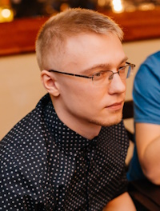

# Artyom Frolov, Chelyabinsk, Russian Federation
<!--  -->
<!-- 

 -->

     

## Bio
I'v been working in sales for the last years. Sometimes times it was interesting: to open new branches, train new employees, visit new cities. But over time, the company, like the entire industry, fell into stagnation and there were no interesting responsibilities that involve gaining new experience at all, so now there is no motivation to work in this area.
At the same time with my main job, I also learn programming in my free time. I stoped at web development, but there is no certainty yet: what is more interesting: front or back.
Rigth now I'm somehow know:
html/css
javascript
Languages: 
Russian (native)
English C2(EFSET.org), actualy something about B2,  i think

## Social and location
*   Telegram: https://t.me/BrokenHands
*   E-mail: bsbd42@yandex.ru
*   GitHub: @BrknHnds
